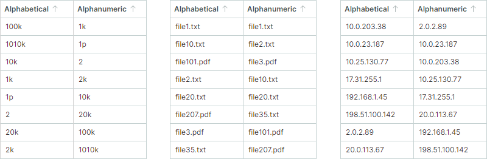
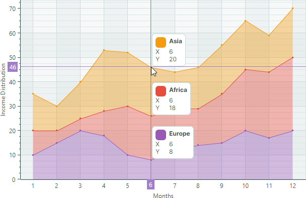
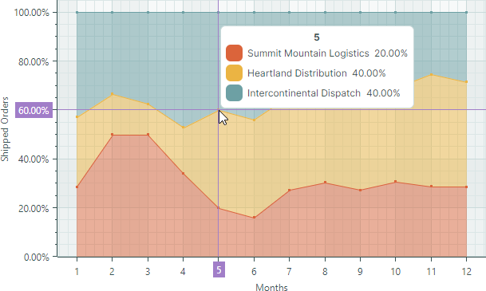

# 版本 1.3


## 1.3.62

### DataGrid、TreeList 和 TreeView

- DataGrid — 新增了 `GetSourceItem` 和 `GetSourceItemValue` 方法。它们允许您通过数据源项索引获取数据源项及其值。

- DataGrid、TreeList 和 TreeView — 新增了防止在鼠标右键单击时更改焦点的功能。

    当用户右键单击某行或某个单元格时，焦点会移动到该行/单元格。此版本新增了 `DataControlBase.ProcessPointerPressedOnCell` 和 `DataControlBase.ProcessPointerPressedOnRow` 虚方法，您可以重写这些方法以防止在鼠标右键单击时更改行焦点。使用以下代码实现此任务：

    ``` cs
    public class CustomTreeViewControl : TreeViewControl
    {
        protected override Type StyleKeyOverride => typeof(TreeViewControl);
        protected override void ProcessPointerPressedOnCell(PointerPressedEventArgs e, int visibleRowIndex, ColumnBase? column)
        {
            var pointerProperties = e.GetCurrentPoint(this).Properties;
            if (pointerProperties.IsRightButtonPressed)
                return;
            base.ProcessPointerPressedOnCell(e, visibleRowIndex, column);
        }

        protected override void ProcessPointerPressedOnRow(PointerPressedEventArgs e, int visibleRowIndex)
        {
            var pointerProperties = e.GetCurrentPoint(this).Properties;
            if (pointerProperties.IsRightButtonPressed)
                return;
            base.ProcessPointerPressedOnRow(e, visibleRowIndex);
        }
    }
    ```

- 已修复问题：DataGrid — 当列的 `ColumnFilterMode` 属性设置为 `DisplayText` 时，为筛选面板中显示的值触发了 `CustomColumnDisplayText` 事件。在这种情况下不应触发该事件。

- 已修复问题：DataGrid 和 TreeList — 当用户修改其他行单元格时，未触发 `CustomUnboundColumnData` 事件。

- 已修复问题：DataGrid 和 TreeList — 当固定列同时设置了 'Auto' 宽度和 `MinWidth` 时，出现 "Layout cycle detected" 错误。

- 已修复问题：DataGrid 和 TreeList — 滚动控件时发生内存泄漏。

- 已修复问题：DataGrid 和 TreeList — 如果编辑器包含无效值，自动筛选行中可能会打开带有筛选运算符的弹出窗口。

- 已修复问题：DataGrid 和 TreeList — 更新数据并垂直滚动后单元格宽度不正确。

- 已修复问题：DataGrid 和 TreeList — 如果控件包含未指定 `FieldName` 属性的列，则通过列筛选菜单进行筛选不起作用。

- 已修复问题：TreeList — 如果 `ExpandNodesOnFiltering` 设置为 `true`，当数据源触发不影响筛选的更改时，控件会展开节点。

### 图表

- 已修复问题：Stacked Area Series Views — 当十字线标签合并所有系列（`OneForAllSeries` 模式）时，标签中系列名称的可视顺序被颠倒——与填充区域的可视顺序不一致。

### PropertyGrid

- 已修复问题：在内置 `PopupColorEditor` 中选择值时会引发异常。


### Docking 界面

- 已修复问题：在特定情况下，反序列化带有自动隐藏面板的 `DockManager` 时会引发异常。

### Graphics3D Control

- 已修复问题：使用 `SelectionMode` 属性禁用选择时，已选中的元素会被隐藏。


## 1.3.49

### DataGrid 和 TreeList

#### 固定列

借助固定列功能，您可以将 DataGrid 和 TreeList 控件中的列固定在左边缘或右边缘，使这些列始终保持可见。这些列在水平滚动期间保持不动，而其他列则正常移动。


要允许用户在运行时固定或取消固定列，请在列标题菜单中启用内置的 _Fixed_ 子菜单：


相关 API：

- `ColumnBase.FixedMode`
- `DataGridControl.ShowColumnMenuFixedItem` 和 `TreeListControl.ShowColumnMenuFixedItem`
- `DataGridControl.ExtendScrollbarToFixedColumns` 和 `TreeListControl.ExtendScrollbarToFixedColumns`
- `DataGridControl.FixedColumnSeparatorWidth` 和 `TreeListControl.FixedColumnSeparatorWidth`

了解更多：

- [Data Grid - 固定列](../controls/datagrid/columns.md#fixed-columns)
- [Tree List - 固定列](../controls/treelist/columns.md#fixed-columns)


#### 在自动筛选行中显示条件运算符

自动筛选行已得到增强，支持在各个单元格中运行时选择筛选运算符。启用此功能后，每个自动筛选行单元格中都会出现一个筛选运算符图标。用户可以点击此图标打开下拉菜单并选择所需的运算符。


相关 API：

- `DataGridControl.ShowConditionInAutoFilterRow`
- `TreeListControl.ShowConditionInAutoFilterRow` 
- `ColumnBase.ShowConditionInAutoFilterRow`

了解更多：

- [Data Grid - 启用运行时筛选运算符选择器](../controls/datagrid/filter-and-search.md#enable-runtime-filter-operator-selectors)
- [Tree List - 启用运行时筛选运算符选择器](../controls/treelist/filter-and-search.md#enable-runtime-filter-operator-selectors)

#### 列筛选菜单 — 带复选框的列表模式

列筛选菜单现在允许您以带复选框的列表形式展示其项目。在带复选框的列表模式下，使用内置复选框可同时选择多个筛选值。


您可以使用以下属性为所有列或单个列启用带复选框的列表显示模式：

- `DataGridControl.ColumnFilterPopupMode` 和 `TreeListControl.ColumnFilterPopupMode`
- `GridColumn.FilterPopupMode` 和 `TreeListColumn.FilterPopupMode`

了解更多：

- [Data Grid - 带复选框的列表筛选模式](../controls/datagrid/filter-and-search.md#list-and-checked-list-display-modes)
- [Tree List - 带复选框的列表筛选模式](../controls/treelist/filter-and-search.md#list-and-checked-list-display-modes)


#### 导出为图像

DataGrid 和 TreeList 控件现在支持将数据导出为图像格式（PNG、JPEG、SVG 和 WebP），并支持分页。


指定页面大小并调用新的 `ExportToImages` 方法。导出引擎会自动将源控件拆分为多个页面，并将每个页面另存为单独的图像。`ExportToImages` 方法使用与 `ExportToPdf` 方法相同的分页机制。

了解更多：

- [Data Grid - 导出为图像格式](../controls/datagrid/export.md#export-to-image-formats)
- [Tree List - 导出为图像格式](../controls/treelist/export.md#export-to-image-formats)

#### 导出为 CSV

DataGrid、TreeList 和 TreeView 控件支持将数据导出为 CSV 格式。CSV 是一种文本格式，其中行值由特定分隔符（默认为逗号）分隔。使用 `ExportToCsv` 方法导出控件的数据。此方法的参数允许您自定义值导出模式、分隔符字符等。

- [Data Grid - 导出为 CSV](../controls/datagrid/export.md#export-to-csv-format)
- [Tree List - 导出为 CSV](../controls/treelist/export.md#export-to-csv-format)

#### 字母数字排序

除默认的字母排序外，DataGrid、TreeList 和 TreeView 控件现在还支持字母数字排序。当列包含文本和数字混合内容时，此算法非常有用。它通过按数值大小比较数字，以人类友好、逻辑清晰的顺序排列字符串。



使用 DataGrid、TreeList 和 TreeView 控件公开的 `DataControlBase.TextSortMode` 属性来启用字母数字排序。此属性会影响所有显示文本值的列的排序。

了解更多：

- [DataGrid - 排序](../controls/datagrid/sorting.md#alphanumeric-sorting)
- [TreeList - 排序](../controls/treelist/sorting.md#alphanumeric-sorting)


### 图表

#### Stacked Area 视图

此版本为 CartesianChart 控件新增了两个视图：

- **Stacked Area View** 将数据系列表示为一个彩色图层。这些图层垂直堆叠，以显示数据系列之间的绝对关系。在任意给定点，图层的高度对应其各自的值，而整个堆叠的总高度则表示所有系列的累计总和。



- **Full-Stacked Area View（即 100% Stacked Area View）** 同样将数据系列渲染为彩色图层。但是，这些视图用于可视化比例关系。每个图层的高度表示其在该点总量中所占的百分比份额，而不是显示绝对值。顶部线条始终表示 `100%`。



了解更多：

- [Stacked Area Series View](../controls/charts/cartesian-series-views/stacked-area-series-view.md)
- [Full-Stacked Area Series View](../controls/charts/cartesian-series-views/full-stacked-area-series-view.md)


#### 交换 X 轴和 Y 轴

新的 `CartesianChart.SwapAxes` 属性允许您转置 _X_ 轴和 _Y_ 轴。将其设置为 `true`，即可垂直显示 _X_ 轴，水平显示 _Y_ 轴。


了解更多：

- [交换 X 轴和 Y 轴](../controls/charts/cartesian-chart.md#swap-the-x-and-y-axes)

#### 反转坐标轴方向

CartesianChart 控件现在包含 `Axis.Reverse` 属性，用于更改任意坐标轴的方向。当它设置为 `true` 时，坐标轴数值的顺序将被反转：

- _X_ 轴将从右到左显示数值，而不是默认的从左到右方向。
- _Y_ 轴将从上到下显示数值，而不是默认的从下到上方向。


了解更多：

- [反转坐标轴方向](../controls/charts/cartesian-chart.md#reverse-the-axis-direction)


#### 空数据点

CartesianChart 和 PolarChart 现在支持空数据点（值未定义的数据点）。图表控件在遇到空数据点时会在系列中留下可见的间隙。


要指定一个空数据点，请将数据点的值设置为 _double.NaN_、_double.PositiveInfinity_ 或 _double.NegativeInfinity_。

了解更多：

- [空数据点（间隙）](../controls/charts/cartesian-chart.md#empty-points-gaps)

### Graphics3DControl

#### 新 API

新的 `LookCameraAtScene` 方法允许您定位相机并调整其方向，使其从指定方向看向 3D 场景的中心。

<code>LookCameraAtScene(Vector3 cameraViewDirection, Vector3 upDirection)</code>


<!-- TODO
check:
from a specific angle???

добавил метод Graphics3DControl.LookCameraAtScene(Vector3 cameraPosition, Vector3 upDirection) - вектора это просто направления, тоесть 1,0,0 тоже самое что 100,0,0

cameraPosition - это точка?
 -->

#### 在 Gizmo 中显示轴名称

Graphics3DControl 的 Gizmo 现在会显示 _X_、_Y_ 和 _Z_ 轴的名称。


为渲染轴名称，`Gizmo` 中新增了三个分别表示字母 "X"、"Y" 和 "Z" 的模型。
新的 `Gizmo.Models` 和 `Gizmo.ModelsSource` 属性允许您指定用于自定义渲染 Gizmo 的 3D 模型。这些属性取代了现已废弃的旧属性 `Gizmo.Model`。

#### 重大更改 — 渲染 Graphics3DControl 现在需要配色主题

从 1.3 版本开始，`Graphics3DControl` 和 `Gizmo` 类继承自 `Graphics3DControlBase`，该类是 `TemplatedControl` 类的派生类。
这些控件的通用外观设置现在由 `Controls3D` 配色主题指定。为确保 `Graphics3DControl` 正确渲染，您必须在 _App.xaml_ 文件中注册该主题：

``` xml
<!-- App.xaml file -->
<Application ...
    xmlns:theme3D="clr-namespace:Eremex.AvaloniaUI.Themes.Controls3D;assembly=Eremex.Avalonia.Controls3D"
             >
    <Application.Styles>
        ...
        <theme3D:Controls3DTheme />
    </Application.Styles>
</Application>
```

如果未注册 `Controls3D` 配色主题，则 `Graphics3DControl` 将显示为空白。

### Docking

现在，您可以使用 `MinWidth`、`MinHeight`、`MaxWidth` 和 `MaxHeight` 属性对 dock 项应用调整大小的约束。

### SplitContainerControl - 面板大小约束

新的 `Panel1MinLength`、`Panel1MaxLength`、`Panel2MinLength` 和 `Panel2MaxLength` 属性允许您为 `SplitContainerControl` 中的面板设置调整大小的约束。用户无法将面板大小调整到超出这些限制。

### MxWindow

新的 `Header` 和 `HeaderTemplate` 属性允许您在窗口标题中显示自定义内容。

### 已修复的问题

- 工具栏和菜单 — 如果某个栏目项关联的下拉菜单先前是从栏目的溢出菜单中打开的，则该下拉菜单无法显示。
- Docking — 隐藏自动隐藏项时，该项的标题仍然可见。
- Docking — 当选项卡数量较多时，选项卡面板标题区域的高度计算不正确。

### 重大更改

- Graphics3DControl — `Gizmo.Model` 属性已弃用。请改用新的 `Gizmo.Models` 和 `Gizmo.ModelsSource` 属性。
- Editors — `IsClearTextButtonVisible` 属性已重命名为 `IsNullValueButtonVisible`。
- Editors — `ClearTextCommand` 命令已重命名为 `SetNullValueCommand`，并从 `PopupEditor` 类移动到 `ButtonEditor` 类。


<br>
<br>

<sup>*</sup> 本页面使用机器翻译技术翻译。
